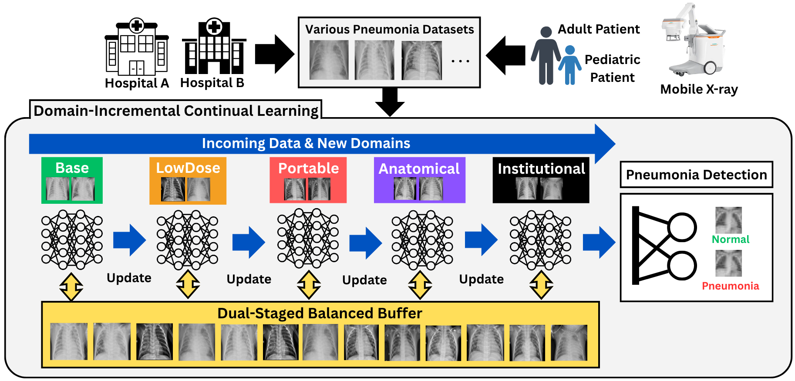
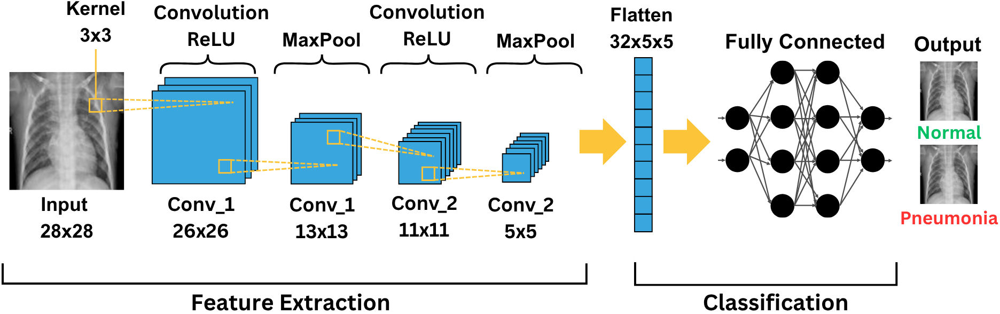
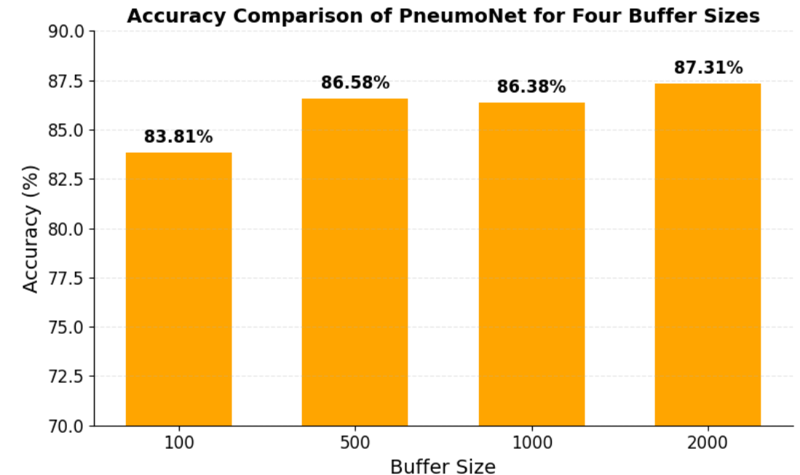
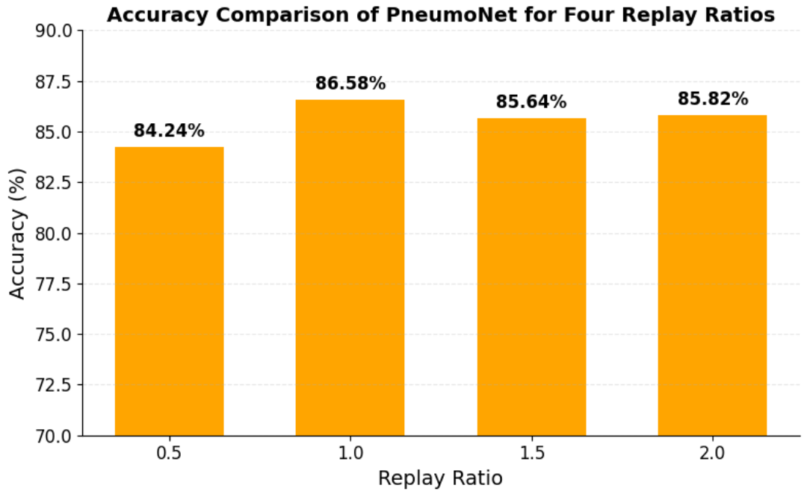
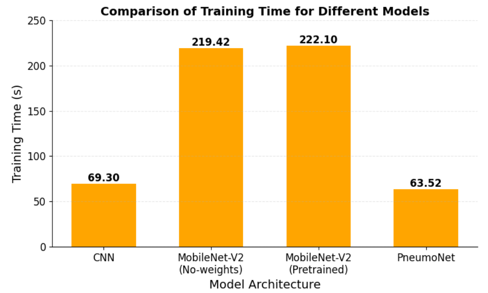
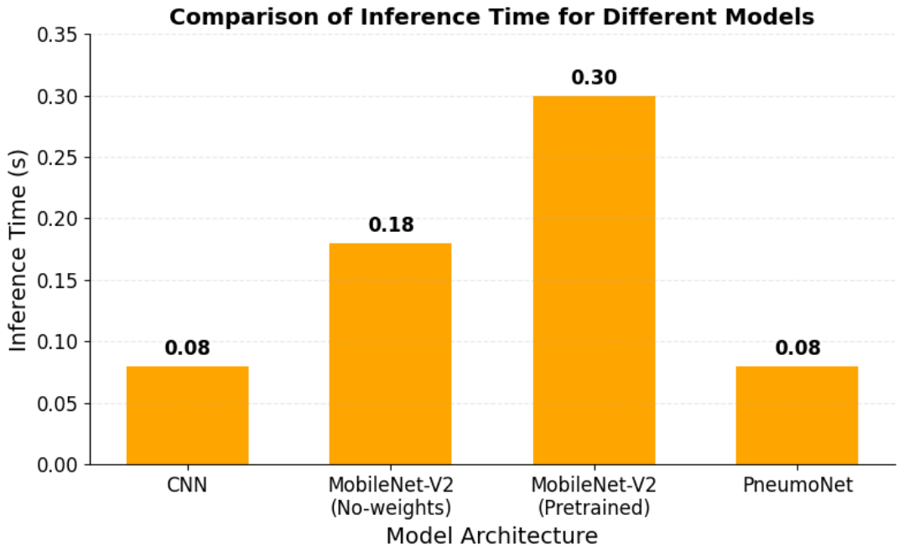

# PneumoNet: On-Device Continual Learning for Point-of-Care Pneumonia Diagnosis

[](https://doi.org/10.48550/arXiv.2605.19201)
[](https://www.python.org/)
[](https://pytorch.org/)

This repository contains the code and experimental workflow for the paper:

**“On-Device Continual Learning with Dual-Stage Buffer and Dynamic Loss for Point-of-Care Pneumonia Diagnosis.”**

PneumoNet is a lightweight domain-incremental continual learning framework for adaptive pneumonia detection from chest X-rays. It is designed for **point-of-care medical devices**, such as portable or mobile X-ray systems, where memory, computation, and network access may be limited.

Unlike replay-heavy continual learning methods that mainly focus on accuracy, PneumoNet emphasizes both **continual learning stability** and **on-device efficiency**. It combines a compact CNN architecture, a dual-stage balanced replay buffer, and a dynamic class-weighted loss to support fast, memory-efficient adaptation under sequential chest X-ray domain shifts.

---

## Overview

Deep learning models can detect pneumonia from chest X-rays with high accuracy, but their performance often declines when the data distribution changes across devices, patient groups, acquisition settings, or institutions.

PneumoNet addresses this problem through **domain-incremental learning**, where the diagnostic task remains the same, but the input domain changes over time. This setting is especially relevant for real-world medical deployment, where a model may encounter new hospitals, mobile X-ray devices, low-dose imaging conditions, or different patient populations after deployment.

PneumoNet is built around three components:

- a **lightweight CNN architecture** for on-device pneumonia prediction
- a **dual-stage balanced buffer** for class-balanced replay
- a **dynamic class-weighted loss** for correcting batch-level imbalance during training

<p align="center">
  
</p>

**Figure 1.** Overview of the PneumoNet domain-incremental learning framework for point-of-care pneumonia diagnosis.

---

## Why On-Device Continual Learning?

In clinical and public-health settings, especially during respiratory disease outbreaks, diagnostic AI systems may need to adapt quickly to new imaging conditions without full centralized retraining.

Centralized retraining can be impractical because of:

- patient privacy constraints
- limited network connectivity
- limited computational resources
- hospital-specific imaging protocols
- mobile or portable X-ray deployment environments

PneumoNet is designed for these constraints. Instead of relying on large models or large replay memory, it uses a compact architecture and efficient replay strategy to support adaptive pneumonia diagnosis directly on resource-constrained devices.

---

## How This Repository Differs from PneumoX-CL

This project is related to previous replay-based continual learning work, but it focuses on a different deployment goal.

| Aspect | PneumoX-CL | PneumoNet |
|---|---|---|
| Main goal | Improve replay diversity | Enable on-device continual learning |
| Core method | Similarity-aware stratified replay | Dual-stage balanced buffer + lightweight CNN |
| Buffer update | Cosine-similarity-based replacement | Per-class reservoir storage + balanced replay |
| Deployment focus | Continual learning robustness | Mobile / portable / point-of-care X-ray devices |
| Main advantage | Higher replay diversity | Smaller, faster, lower-memory model |
| Default buffer size | 2000 samples | 500 samples |
| Key emphasis | Replay-buffer diversity | Model efficiency and deployment practicality |

In short:

**PneumoX-CL focuses on replay diversity.**  
**PneumoNet focuses on efficient on-device adaptation.**

---

## Key Features

- Domain-incremental continual learning for chest X-ray pneumonia detection
- Lightweight CNN architecture for resource-constrained devices
- Dual-stage balanced buffer for class-balanced replay
- Dynamic class-weighted loss for correcting training-batch imbalance
- Evaluation on five sequentially shifted PneumoniaMNIST domains
- Efficiency analysis using model size, memory usage, FLOPs, parameters, training time, and inference time
- Single-notebook workflow for straightforward reproduction

---

## Method

PneumoNet integrates three core components for efficient continual learning under domain shift.

### 1. Lightweight PneumoNet Architecture

PneumoNet uses a compact convolutional neural network designed for fast inference and low memory usage. The model contains two convolutional-pooling blocks for feature extraction, followed by a small fully connected classifier for binary pneumonia diagnosis.

<p align="center">
  
</p>

**Figure 2.** PneumoNet architecture consisting of two convolutional-pooling blocks and a classification stage.

The architecture is designed to reduce:

- model size
- memory usage
- number of parameters
- floating-point operations
- training and inference time

This makes PneumoNet suitable for mobile X-ray systems and other point-of-care diagnostic settings.

---

### 2. Dual-Stage Balanced Buffer

Medical datasets are often class-imbalanced. In continual learning, this imbalance can become more severe because the replay buffer is small and each incoming domain may have a different class ratio.

PneumoNet uses a **dual-stage balanced buffer** to address imbalance at two levels:

1. **Balanced storage:**  
   Incoming samples are stored using class-specific reservoir buffers so that both normal and pneumonia samples receive fair memory allocation.

2. **Balanced replay:**  
   During training, replay samples are drawn evenly from class-specific buffers so that replayed batches do not become dominated by the majority class.

This strategy helps preserve diagnostic knowledge from previous domains while reducing class imbalance during replay.

---

## Domain-Shifted PneumoniaMNIST Benchmark

This repository uses **PneumoniaMNIST** from the **MedMNIST** collection. PneumoniaMNIST contains pediatric chest X-ray images for binary classification of normal versus pneumonia cases.

To evaluate domain-incremental learning, the original PneumoniaMNIST dataset is transformed into five sequential domains:

1. **Base**  
   Original PneumoniaMNIST images.

2. **LowDose**  
   Simulates low-dose radiation imaging using intensity reduction and noise injection.

3. **Portable**  
   Simulates portable ICU imaging using brightness changes and blur.

4. **Anatomical**  
   Simulates posture and body-habitus variation using translation and scaling.

5. **Institutional**  
   Simulates inter-hospital variation using contrast, brightness, and sharpness changes.

The default sequential order is:

```text
Base → LowDose → Portable → Anatomical → Institutional
```

---

## Repository Structure

```text
.
├── PneumoNet.ipynb
├── README.md
├── requirements.txt
├── LICENSE
└── assets/
    ├── pneumonet_overview.png
    ├── pneumonet_architecture.png
    ├── buffer_size_analysis.png
    ├── replay_ratio_analysis.png
    ├── training_time_comparison.png
    └── inference_time_comparison.png
```

- `PneumoNet.ipynb` — main notebook containing dataset preparation, domain construction, model training, replay logic, evaluation, and visualization
- `README.md` — project overview and usage instructions
- `requirements.txt` — package dependencies for reproduction
- `LICENSE` — license file
- `assets/` — figures used in this README

---

## Installation

This repository is designed to run conveniently in **Google Colab**.

To install dependencies, run:

```bash
pip install -r requirements.txt
```

A recommended `requirements.txt` includes:

```text
torch
torchvision
numpy
pandas
matplotlib
scikit-learn
medmnist
tqdm
```

---

## Quick Start

Open and run:

```text
PneumoNet.ipynb
```

To reproduce the main experiments, run all notebook cells sequentially.

The notebook includes:

- environment setup
- PneumoniaMNIST download and preparation
- domain-shifted dataset construction
- baseline continual learning experiments
- PneumoNet training
- accuracy and forgetting evaluation
- buffer-size and replay-ratio analysis
- model efficiency comparison

A GPU runtime in Google Colab is recommended for practical execution time.

---

## Paper-Default Experimental Setting

The notebook is configured around the paper-default experimental workflow:

| Setting | Value |
|---|---|
| Dataset | Domain-shifted PneumoniaMNIST |
| Task | Binary pneumonia classification |
| Continual learning setting | Domain-incremental learning |
| Sequential domains | Base, LowDose, Portable, Anatomical, Institutional |
| Backbone | Lightweight PneumoNet CNN |
| Optimizer | Adam |
| Learning rate | 0.001 |
| Batch size | 32 |
| Replay buffer size | 500 |
| Epochs per domain | 50 |
| Replay ratio | 1.0 |
| Number of runs | 3 |

---

## Continual Learning Results

PneumoNet achieves strong continual learning performance while maintaining a lightweight deployment profile.

| Method | Accuracy (%) | Forgetting (%) |
|---|---:|---:|
| Joint Training | 87.17 ± 1.34 | 0.00 ± 0.00 |
| Fine Tuning | 80.92 ± 0.61 | 5.02 ± 0.74 |
| ER | 84.10 ± 0.94 | 3.45 ± 1.19 |
| CBRS | 84.96 ± 1.14 | 2.74 ± 0.38 |
| **PneumoNet** | **86.58 ± 0.36** | **1.43 ± 0.24** |

PneumoNet achieves the best performance among the continual learning methods evaluated in this repository. It improves both accuracy and forgetting compared with ER and CBRS while using a small replay buffer suitable for resource-constrained settings.

---

## Domain-Wise Performance

The following table summarizes PneumoNet performance across the five sequential domains during continual learning.

| Domain | After D1 | After D2 | After D3 | After D4 | After D5 |
|---|---:|---:|---:|---:|---:|
| Base | 86.33 | 86.38 | 87.50 | 90.06 | 88.73 |
| LowDose | - | 85.79 | 83.55 | 83.92 | 83.55 |
| Portable | - | - | 87.39 | 87.77 | 86.91 |
| Anatomical | - | - | - | 87.98 | 85.47 |
| Institutional | - | - | - | - | 88.25 |

The results show that PneumoNet maintains stable performance across previously seen domains while adapting to new domain shifts.

---

## Buffer and Replay Sensitivity

To analyze the trade-off between memory efficiency and performance, PneumoNet is evaluated with different replay buffer sizes and replay ratios.

### Buffer Size Analysis

<p align="center">
  
</p>

**Figure 3.** Accuracy of PneumoNet under different replay buffer sizes.

The largest improvement occurs when increasing the buffer size from 100 to 500 samples. Larger buffers provide additional gains, but the 500-sample setting already achieves strong performance while preserving memory efficiency.

### Replay Ratio Analysis

<p align="center">
  
</p>

**Figure 4.** Accuracy of PneumoNet under different replay ratios.

A replay ratio of 1.0 provides the best balance between learning from the current domain and retaining knowledge from previous domains.

---

## On-Device Efficiency Results

A major goal of PneumoNet is to support continual learning under resource-constrained point-of-care settings. Therefore, in addition to accuracy and forgetting, we evaluate model size, memory usage, FLOPs, parameter count, training time, and inference time.

| Model | Model Size (MB) | Memory (MB) | FLOPs (MFLOPs) | Parameters |
|---|---:|---:|---:|---:|
| CNN | 1.61 | 1.60 | 135.68 | 420,610 |
| MobileNet-V2 (No-weights) | 8.71 | 8.49 | 197.57 | 2,225,858 |
| MobileNet-V2 (Pretrained) | 8.71 | 8.49 | 197.57 | 2,225,858 |
| **PneumoNet** | **0.22** | **0.21** | **22.60** | **56,194** |

PneumoNet is substantially smaller and more efficient than the baseline CNN and MobileNet-V2 models. It reduces model size, memory usage, FLOPs, and parameter count while maintaining competitive continual learning performance.

### Training Time

<p align="center">
  
</p>

**Figure 5.** Training time comparison across model architectures.

PneumoNet shortens the training cycle compared with larger architectures, which is important for on-device continual learning where frequent incremental updates may be required.

### Inference Time

<p align="center">
  
</p>

**Figure 6.** Inference time comparison across model architectures.

PneumoNet supports fast inference, making it suitable for real-time pneumonia prediction in portable or mobile X-ray environments.

---

## Notes on Reproducibility

- The code is organized as a single-notebook workflow for ease of inspection and execution.
- PneumoniaMNIST is downloaded automatically when it is not already available locally.
- If an existing local copy of the dataset is present, the notebook reuses it.
- Results may vary slightly depending on hardware, random seed, and library versions.
- Google Colab with GPU runtime is recommended for practical reproduction.
- The default implementation uses a replay buffer size of 500 and replay ratio of 1.0.

---

## Associated Paper

**On-Device Continual Learning with Dual-Stage Buffer and Dynamic Loss for Point-of-Care Pneumonia Diagnosis**  
Danu Kim

Presented at the **32nd Samsung Humantech Paper Awards**.

- **arXiv:** arXiv:2605.19201 [cs.LG]
- **Version:** arXiv:2605.19201v1
- **Subjects:** Machine Learning (cs.LG); Artificial Intelligence (cs.AI)
- **DOI:** https://doi.org/10.48550/arXiv.2605.19201

---

## Citation

If you find this repository useful, please cite:

```bibtex
@misc{kim2026pneumonet,
  title={On-Device Continual Learning with Dual-Stage Buffer and Dynamic Loss for Point-of-Care Pneumonia Diagnosis},
  author={Danu Kim},
  year={2026},
  eprint={2605.19201},
  archivePrefix={arXiv},
  primaryClass={cs.LG},
  doi={10.48550/arXiv.2605.19201}
}
```

---

## Contact

**Danu Kim**  
Korea International School, Jeju Campus  
Email: dukim27@kis.ac

---

## License

This project is released under the license provided in the `LICENSE` file.
